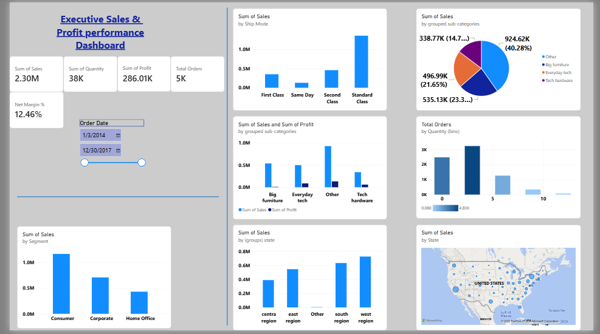

# Superstore Executive Analytics Platform (MySQL + Power BI)

## 📊 Project Overview
This repository contains an end-to-end data analytics and engineering solution. The project handles raw transactional retail records using a MySQL data pipeline and transforms it into an interactive Power BI executive application built to track corporate KPIs, strategic product groupings, and profit stability.

## 🛠️ Tech Stack & Tools
* **Database Layer:** MySQL (Database Creation, Table Schemas, Relational Scripting)
* **Analytics Layer:** Power BI Desktop (Data Modeling, DAX Measures, UX Visual Architecture)

## 🗄️ Phase 1: Data Architecture & Extraction (MySQL)
The complete database initialization and table configuration scripts are stored in `superstore_mysql_analysis.sql`. Key database actions executed:
* Designed a comprehensive 21-column relational schema (`sales` table) with industry-standard data types.
* Restructured transaction attributes (Keys, Dates, Sales, and Profit margins) to enable a clean data import.

## 📈 Phase 2: Interactive Reporting & UX Design (Power BI)
The visual dashboard file `Superstore_Executive_Dashboard.pbix` translates database layers into clean enterprise metrics:
* **Strategic Bins & Groups:** Structured hybrid product categories and customized price tags using numerical bins.
* **UX Component Logic:** Configured interactive "Between" timeline range sliders and structured KPI group rows.
* **Design Standards:** Developed deep-corporate blue gradient conditional themes to prioritize top revenue segments.

## 📷 Dashboard Preview

